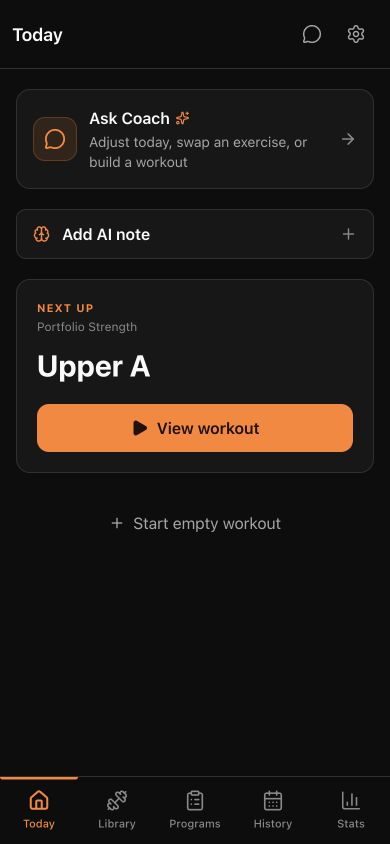
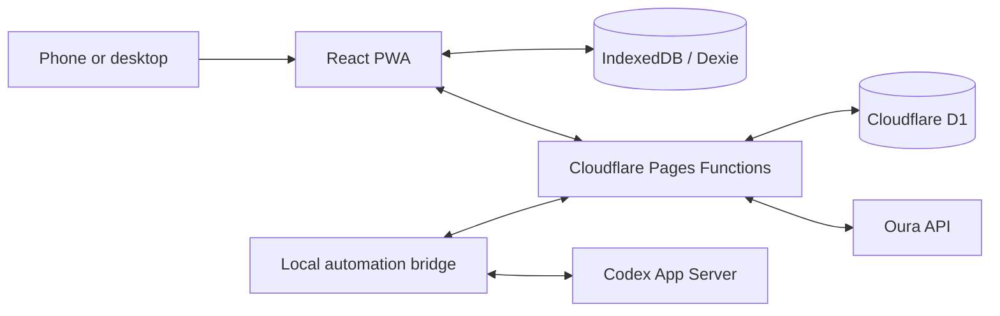

# Gym

[](https://github.com/Akshin0906/gym/actions/workflows/ci.yml)
[](https://workout-tracker-ay9.pages.dev)

Gym is a mobile-first, offline-first workout tracker for planning hypertrophy
training, logging sets quickly, reviewing progress, and working with a
confirmation-gated AI coach.

<p align="center">
  <a href="https://workout-tracker-ay9.pages.dev">
    
  </a>
</p>

**[Try the live app](https://workout-tracker-ay9.pages.dev)** — the exercise
library and all local workout features work without an account. Cloud snapshots,
Oura data, and the AI Coach require private credentials and are intentionally not
enabled for public visitors.

## What it demonstrates

- An installable React PWA that remains useful offline and stores workout data in
  IndexedDB through Dexie.
- Complete exercise, program, workout, history, backup, and analytics flows built
  for a phone-sized gym interface.
- Cloudflare Pages Functions and D1 endpoints with session hashing, atomic rate
  limiting, version-checked snapshots, lease ownership, idempotent receipts, and
  stale-write protection.
- An AI Coach that may propose memories, exercises, programs, or workout changes,
  but cannot mutate trusted training data until the user confirms the action on
  the phone.
- A failure-aware local automation bridge with bounded retries, durable spooling,
  constrained Codex execution, and recovery across interrupted sessions.

## Product tour

- **Today:** resume an active workout or start the next session in the active
  program.
- **Workout:** compare prior performance, log/edit/delete sets, swap exercises,
  and run a persistent rest timer.
- **Programs and library:** build reusable training templates, reorder sessions,
  edit targets, and manage custom exercises without losing history.
- **History and stats:** review completed sessions, muscle-group volume, and
  estimated one-rep-max trends.
- **Coach and AI Memory:** chat over a bounded training context and explicitly
  approve every proposed data change.
- **Settings:** export/import validated JSON backups, request persistent browser
  storage, pair a cloud mirror, and optionally connect Oura recovery data.

## Architecture



IndexedDB remains the trusted workout store. D1 holds an authenticated snapshot
mirror plus the Coach queue, transcript, action reservations, and receipts. The
bridge receives a narrowly scoped automation credential; the constrained Codex
subprocess receives neither that secret nor network/tool access. See
[automation/README.md](automation/README.md) for the detailed bridge and daily
briefing design.

## Engineering highlights

- **Offline and resilient:** route chunks and assets are precached, active
  workouts survive reloads, and backup imports validate the complete graph before
  replacing any local data.
- **Race-safe cloud writes:** snapshot compare-and-swap, reservation ownership,
  logout fencing, and exact receipt replay prevent duplicate or stale Coach
  actions.
- **Safe rendering:** assistant Markdown supports GFM tables and links without
  accepting raw HTML, while user-authored messages remain plain text.
- **Release discipline:** the repository runs TypeScript, ESLint, Vitest, Python
  automation tests, SQLite smoke tests, migration checks, shell validation, an
  npm security audit, and a production build in CI.

## Stack

- React 19, TypeScript, Vite, Tailwind CSS, and React Router
- Dexie and IndexedDB for local-first persistence
- Cloudflare Pages Functions and D1 for the cloud boundary
- Vitest plus Python/SQLite validation for application and backend behavior
- `vite-plugin-pwa` for the manifest, service worker, and installable experience

## Local development

Requirements: Node.js 22.22 or newer, npm 10.9 or newer, and Python 3.10 or
newer for the automation tests.

```bash
npm ci
npm run dev
```

Run the same core gate used by CI:

```bash
npm run validate
npm audit --audit-level=high
```

For local Pages Functions, copy `.dev.vars.example` to `.dev.vars`, use only
local throwaway values, build the app, and run Wrangler against an isolated D1
directory.

## Cloud deployment

The production configuration is in [wrangler.toml](wrangler.toml). Runtime
secrets belong in Cloudflare, never in Git:

```bash
npx --yes wrangler@4.119.0 pages secret put CLOUD_PAIRING_SECRET \
  --project-name workout-tracker
npx --yes wrangler@4.119.0 pages secret put CLOUD_AUTOMATION_SECRET \
  --project-name workout-tracker
```

Apply pending D1 migrations before deploying code that depends on them, then use
the pinned deployment script:

```bash
npx --yes wrangler@4.119.0 d1 migrations apply workout-tracker --remote
npm run deploy
```

## Security, privacy, and scope

- Workout data is local by default. The cloud feature is a version-checked
  single-user mirror, not an automatic multi-device merge service.
- Oura's OAuth access token is stored only in that browser's local storage and is
  sent through an allowlisted same-origin proxy; disconnecting removes it.
- Local automation state, logs, credentials, database snapshots, and build output
  are ignored by Git.
- The coaching and recovery features are informational training tools, not
  medical advice.

## License

No license has been selected. Until one is added, the source is publicly viewable
but is not licensed for third-party reuse.
